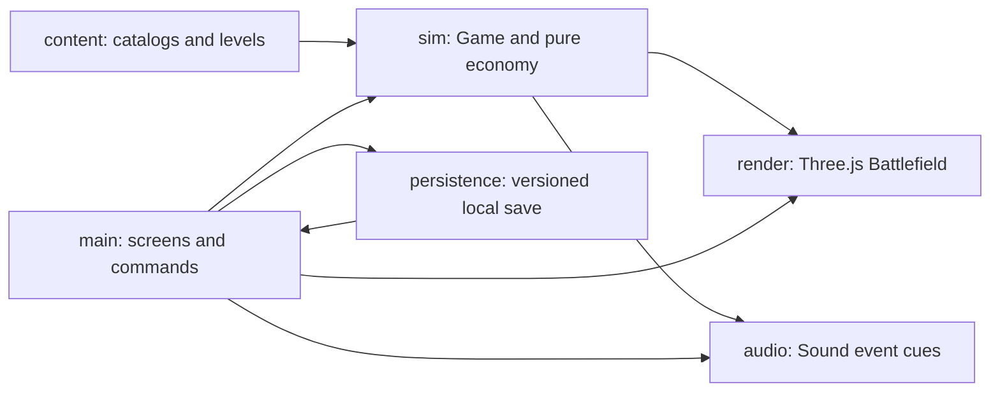

# Architecture and extension points

The working boundary is a browser-independent TypeScript simulation with presentation adapters. The published game is static; local authoring adds a file adapter. Content definitions are plain data; a fresh `Game` owns every attempt.

| Boundary                                   | Implemented responsibility                                                                                    | Extension point                                                           |
| ------------------------------------------ | ------------------------------------------------------------------------------------------------------------- | ------------------------------------------------------------------------- |
| `src/content`                              | Tower/enemy/card catalogs and three campaign encounters                                                       | Add level data, register it, validate and test                            |
| `src/sim/game.ts`                          | Commands, 30 Hz simulation, damage, movement, targets, waves and outcomes                                     | Add a rule with focused deterministic tests                               |
| `src/sim/economy.ts`                       | Fixed wave rewards and sell refunds                                                                           | Tune authored rewards alongside catalog costs and strategy evidence       |
| `src/render/battlefield.ts`                | Flat orthographic painted battlefield, continuous trail, rig direction/aim, picking, range and effects        | New visual without importing browser APIs into simulation                 |
| `src/render/cutout.ts`, `character-rig.ts` | Shared native textures, per-actor joints and view-aware walking                                               | Descriptor-driven parts; side IK and front/rear projected legs            |
| `src/main.ts`                              | Semantic HTML screens, input commands, attempt lifecycle and HUD                                              | New screen or input adapter; currently a deliberately small single module |
| `src/audio/sound.ts`                       | Gesture-unlocked music and synthesized cue family                                                             | New licensed track or cue, preserving volume/mute lifecycle               |
| `src/persistence/save.ts`                  | Version 2 validation/defaults, legacy save migrations, stars, settings, Squirrel upgrade and Turtle discovery | Explicit migration for future schema changes                              |
| `src/qa/benchmark.ts`                      | Separate artificial browser stress fixture                                                                    | Raw RAF measurement; never used by normal gameplay                        |

Simulation commands return success/failure and emit lightweight events. The UI translates commands into feedback; rendering reads state. `advance` accumulates fixed 1/30-second steps and limits long-frame catch-up. `tick` is available to deterministic tests. Randomness uses a seeded generator; current encounter rules have no random targeting or damage. Fixed seeds alone do not make browser frame timings deterministic.

Coordinates use integer `x,z` grid positions. Paths are axis-aligned polylines;
rendered corner rounding is cosmetic. Occupancy excludes path tiles and blocked
tiles. Towers cannot reroute enemies. The presentation maps simulation coordinates
onto a flat orthographic stage with separate horizontal/vertical spacing, a painted
biome plate, and a textured continuous trail. Approved tower footprints remain
screen aligned. Runtime character rigs choose front/rear views for vertical travel
and side views for current rightward segments. Gait, reload and idle motion read
simulation time/distance, so pause freezes them. A defender hit is tested before ground picking, including during placement previews.
Ground taps select a pending cell; an explicit confirmation issues the placement command.

`src/render/battle-art.ts` selects cutout resources from the immutable attempt's
enemy and available-defender roster. The battlefield joins those resources with
scenery readiness before enabling battle input, and owns the WebGL context and
painted texture disposal. The module disposes selected cutouts on replacement or
attempt retirement. See [decision 035](decisions/035-battle-art-demand-and-readiness.md)
and the [simulated loading benchmark](benchmarks/art-loading.md).

## Add an encounter

Follow the [agent content authoring contract](agents/content-authoring.md) for schema, editor and runtime consistency.

1. Add an encounter recipe to `src/content/recipes.json`. Supply its unique stable id, dimensions, orthogonal path, blocked cells, starting crowns, roster and wave recipes. Each wave and repeated packet needs a stable identity; preserve those identities when reordering content.
2. Place the recipe in campaign order in the canonical `levels` array. `compileLevel` derives runtime groups from readable repeated packets; the small encounter TypeScript exports are compatibility modules, not authoring sources.
3. Canonical recipe order automatically registers encounters and their save whitelist. Extend discovery rules only if the new encounter awards tools.
4. Validate the complete content with the shared configuration interface and run legal strategies through the actual `Game`. Add focused coverage for new behavior and inspect nominal versus fixed-tick spawn timing in the local workbench.
5. Check its map position, briefing, battle readability, intended duration, win and replay in the browser. Verify draft save, Playtest, scoped Promote and game reload through the workbench; content-only promotion must work without rebuilding JavaScript.

**Working extension evidence:** commit `3fbd136` adds Rainstone Crossing after foundation commit `48c9a4a`, changing only its content file and registry. No combat, renderer or UI restructuring was needed. Ticket 05 registers The Last Lantern as the third board encounter, adds its final-boss rule and saves its completion. The original first board remains finite. Additional authored encounters register from canonical recipe order and use a scrollable campaign card grid.

## Add a tower/enemy/card

Catalog data controls existing roles. Each encounter declares its available
defenders, while persistent progress declares which upgrades are usable. A
genuinely new attack behavior also needs a typed kind, simulation rule, asset bounds, UI explanation and tests. Do not
represent new mechanics as arbitrary strings or pretend the catalog can express
behavior it cannot. Rig resources map each role to generated parts; see
`ART-PIPELINE.md` for import, source provenance and visual review. Legacy atlas
indices remain fallback metadata. Advantage definitions can modify range, slow
duration, or upgrade cost, but remain dormant until a campaign reward explicitly
unlocks them.

## Current encounter rules

Lantern Pass teaches Rat guard and awards Squirrel upgrades. Rainstone Crossing uses four mixed Rat/Weasel waves and awards Turtle discovery. Spawn groups author internal quiet gaps, local movement multipliers and guard/evasion cycles. Evasion is deterministic at projectile impact; missed nets do not refresh slow. The renderer shares spawn-relative warning timing, then presents the yellow marker, sidestep and floating Evade text from simulation outcomes. See [decision 017](decisions/017-rainstone-evasion-and-mixed-waves.md).

Completed encounters add earned Turtle discovery to their attempt roster, allowing players to improve earlier star ratings with Turtle and earned Squirrel upgrades. The briefing, build tray and simulation use that resolved roster. First attempts retain their authored teaching roster. The Last Lantern is registered as the third encounter; its required Roadwarden defeat closes the first board. First victory persists Reach and Longer Nets for replays, without adding a placeholder for a later board.

## Planned boundaries

Extract screen controllers when more screens make `main.ts` unwieldy. Consider shared/instanced terrain geometry and sprite batching only after measurements identify pressure. A save migration registry, content editor, cloud saves, multi-biome campaign and dynamic camera are not implemented. Do not introduce abstractions for them in small content additions.

### Presentation resource costs

Flat articulated limb planes use a single transparent draw pass even when both
sides are visible; they have no separate front/back volume to composite. Impact
rings use one ordered dynamic geometry with per-vertex colour and alpha. The
batch preserves the individual ring topology, position, size and fade, with
regression coverage for growth and stale-effect removal. Neither optimization
changes simulation state or effect timing.

Reloading the same encounter clears actors and interaction overlays while
retaining its scenery and path textures. The reuse key includes the level id,
dimensions and route; a changed layout rebuilds the scenery. QA-only phase timing
separates figure updates, effect updates and synchronous WebGL submission, and
retains long-frame context. These timings do not measure GPU completion.

Character and defender rigs are reused through bounded pools keyed by asset,
height and (for defenders) reflected view. Checked-out rigs are never shared;
released rigs are detached from the scene, and all retained resources are disposed
with the battlefield. Pose and colour are recomputed from current simulation state
before a reused rig renders.

Grounding shadows and injured health bars use three instanced draws, with the
same circle/plane shapes and per-actor transforms as the prior individual meshes.
Unused instances are excluded by count and visibility; health backgrounds and
fills retain distinct painter layers.

Path projection is cached when an encounter layout is loaded. Each animated leg
owns reusable sampling and pose buffers; neither buffer is shared across actors.
The gait still derives contact from simulation distance, including through corners
and resets. Differential tests compare both maps against the simulation sampler.

Enemy leg meshes now keep static source vertices and apply bone pose uniforms in
the vertex shader. Side-view transforms retain the same two-bone blend; front/rear
views retain upright boots and projected cloth movement. Each leg owns its pose
uniforms, while materials share the compiled shader program. This removes repeated
leg vertex-buffer uploads without changing simulation or gait targets.

## Designer workbench

`src/content/recipes.json` is the schema-versioned canonical source for encounter
recipes, catalogs and supported gameplay parameters. The existing content modules
are compatibility exports compiled from that source. `src/config/configuration.ts`
validates and resolves immutable attempt snapshots. The simulation and timeline
share `src/sim/spawn-schedule.ts`; authored insertion order is preserved, and
nonmonotonic batch/group edits are rejected.

The local `workbench.html` entry owns `src/workbench` editor, scenario, replay,
policy, search and experiment-storage adapters. Its attempt view reads the same
`Game`, `Battlefield`, sound and semantic battle components as the campaign, with
no campaign result/profile lifecycle. Difficulty candidates resolve before
progression capabilities; declared scenario overrides apply last. Isolated waves
and overridden starting setups are synthetic evidence, never proof of campaign
affordability.

The production build emits only the game to `dist`. Workbench and QA builds emit
independently to `dist-workbench` and `dist-qa`. A build plugin rejects utility
modules in the reachable production graph, and the artifact check inspects copied
files and emitted controls. Development diagnostics are excluded at compilation.
The Pages workflow uploads only `dist`.

Use authored recipes for tuning, simulation plus presentation for a new supported
ability, and workbench modules for editor/evidence changes. Draft saving is separate
from canonical promotion; the local promotion command validates, checks the base
identity, previews selected scopes, and stages atomic replacement. It does not
commit or deploy. See [workbench usage](WORKBENCH.md) and
[decision 021](decisions/021-designer-workbench.md).

The browser workbench now uses one auto-saved working draft and direct selected-wave Playtest/Promote actions. The local-only Vite workbench adapter validates and atomically writes selected map settings and one wave; it is absent from the production server. Agent CLI scenario, replay, compare and search modules remain available. See [decision 024](decisions/024-single-draft-workbench.md).

### Runtime game content

`src/bootstrap.ts` loads and validates `game-content.json` with caching disabled,
then imports the game. Initialization order ensures catalogs, compiled levels,
rules and save IDs all derive from the same snapshot. Missing or invalid content
blocks startup with a retry action rather than silently playing bundled defaults.
The baseline recipe import remains available for headless tools and tests.

`tools/runtime-content.mjs` emits the JSON for static deployments and provides a
read-only local development/preview route to the canonical file. Promote only
writes that file; it never invokes the compiler. Existing attempts remain immutable.
See [decision 025](decisions/025-runtime-game-content.md).

### Shared abilities

Canonical `abilityDefaults` supplies Rat shield and Weasel evade cycles. Per-wave
boolean switches enable them; `compileLevel` applies shared cycles to each group.
The workbench migrates legacy drafts and promotes shared timings with a selected
map/wave, with conflict checks for the global scope. See [decision 026](decisions/026-shared-wave-abilities.md).

### Tile-anchored defender controls

`src/ui/battle-selection.ts` owns pending placement, remembered roster choice,
inspection and sale confirmation. It issues commands only after explicit actions;
the simulation remains authoritative for affordability, roster, occupancy, upgrade
locks and refunds. `src/ui/defender-popups.ts` presents the approved portrait
carousel and upgrade-first selection card. Campaign and workbench use the same
components; workbench commands still pass through its evidence recorder and replay
lock. Closing, pausing or starting a wave clears pending interaction without
forgetting the chosen defender within the attempt.

The renderer projects cell anchors for bounded nonmodal popups and draws preview
range. The optional thin placement grid follows buildable terrain, excluding paths
and blocked cells. `showGrid` is a strict boolean in each player's saved settings,
defaulting off for existing and new profiles. See decision 029.

### Tower animation direction

Tower combat uses only side cutouts, mirrored toward horizontal target position;
near-vertical targets retain the previous facing. The release pose is briefly
locked to keep the muzzle stable. North/south tower resources are no longer
loaded. Enemy travel rendering remains directional. See [ADR 031](decisions/031-side-only-tower-animation.md)
and the [tower animation process](TOWER-ANIMATION-PROCESS.md).

### Accepted defender motions

`AcceptedDefenderMotion` deforms the original Squirrel and Turtle side bodies
above their planted feet. `DefenderRig` solves the accepted hand paths, bow/string
snap and Turtle two-hand cast. `defenderMotionPhase` anchors release to the real
shot age and preparation to target/cooldown, using the authored interval and
upgrade scale. Idle defenders settle; pause repeats the same pose.
`cast-net.ts` shares one hanging-to-open rope shape between held net and real
projectile; launch stores solved hand positions and facing. Motion owns no damage,
spawn, targeting or cadence rules. See decision 033.

The workbench offers explicit Promote wave and Promote all changes actions.
All promotion merges only changed map metadata, individual waves and shared
abilities, preserving unedited disk content and rejecting conflicts atomically.
See decision 032.

### Roadwarden phases

The simulation owns damage-triggered rage phase, recovery baseline and deadlines
through `boss-rage.ts`; the renderer reads that state. At 25% HP full rage becomes
permanent. Shared ability settings supply trigger percentage, cycle durations and
movement multipliers to immutable attempts; Turtle slow still multiplies the result. Successful rally
casts expose simulation timestamps for renderer-only pulses and escort streaks.
Approved side/front expression resources share the original leg textures. See
decision 034 and the boss-wave review fixture.
