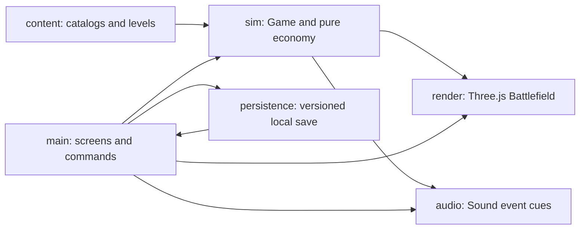

# Architecture and extension points

The working boundary is a browser-independent TypeScript simulation with presentation adapters. There is no server. Content definitions are plain data; a fresh `Game` owns every attempt.

| Boundary | Implemented responsibility | Extension point |
|---|---|---|
| `src/content` | Tower/enemy/card catalogs and two encounters | Add level data, register it, validate and test |
| `src/sim/game.ts` | Commands, 30 Hz simulation, damage, movement, targets, waves and outcomes | Add a rule with focused deterministic tests |
| `src/sim/economy.ts` | Pure interest, trade payout and refunds | Tune rates here; review catalog costs and strategy evidence |
| `src/render/battlefield.ts` | Orthographic 3D tiles, billboard sprites, picking, range and effects | New visual without importing browser APIs into simulation |
| `src/main.ts` | Semantic HTML screens, input commands, attempt lifecycle and HUD | New screen or input adapter; currently a deliberately small single module |
| `src/audio/sound.ts` | Gesture-unlocked music and synthesized cue family | New licensed track or cue, preserving volume/mute lifecycle |
| `src/persistence/save.ts` | Version 1 validation/defaults, stars, settings and unlock | Explicit migration for future schema changes |
| `src/qa/benchmark.ts` | Separate artificial browser stress fixture | Raw RAF measurement; never used by normal gameplay |

Simulation commands return success/failure and emit lightweight events. The UI translates commands into feedback; rendering reads state. `advance` accumulates fixed 1/30-second steps and limits long-frame catch-up. `tick` is available to deterministic tests. Randomness uses a seeded generator; current encounter rules have no random targeting or damage. Fixed seeds alone do not make browser frame timings deterministic.

Coordinates use integer `x,z` grid positions, with Y vertical only in the renderer. Paths are axis-aligned polylines. Occupancy excludes path tiles and blocked tiles. Towers cannot reroute enemies. Camera-facing entities use cropped atlas UV rectangles, an anchor near the feet, and a ground shadow. A structure hit is tested before the ground plane so tapping its visible art selects it.

## Add an encounter

1. Copy `src/content/lantern-pass.ts` into a new content file. Supply a unique id, dimensions, axis-aligned path, blocked cells, starting money, optional health multiplier, and wave groups/rewards.
2. Import and append the definition in `src/content/levels.ts`. Map order controls sequential unlocking.
3. Add its id to the save whitelist if persistent completion is required. The two MVP ids were reserved in the foundation.
4. Validate paths/placement and run an explicit strategy through the level. Add focused test coverage for new rules, not duplicate assertions for every field.
5. Check its map position, briefing, battle readability, intended duration, win and replay in the browser.

**Working extension evidence:** commit `3fbd136` adds Rainstone Crossing after foundation commit `48c9a4a`, changing only its content file and registry. No combat, renderer or UI restructuring was needed. The second reserved save id was already part of the agreed two-level scope. More than two map nodes require deliberate map layout work; this is not an unlimited campaign editor.

## Add a tower/enemy/card

Catalog data controls existing roles. A genuinely new attack behavior also needs a typed kind, simulation rule, asset bounds, UI explanation and tests. Do not represent new mechanics as arbitrary strings or pretend the catalog can express behavior it cannot. Atlas indices connect definitions to the renderer. Cards modify range, starting crowns, slow duration or upgrade cost in simulation.

## Planned boundaries

Extract screen controllers when more screens make `main.ts` unwieldy. Consider shared/instanced terrain geometry and sprite batching only after measurements identify pressure. A save migration registry, content editor, cloud saves, multi-biome campaign and dynamic camera are not implemented. Do not introduce abstractions for them in small content additions.
