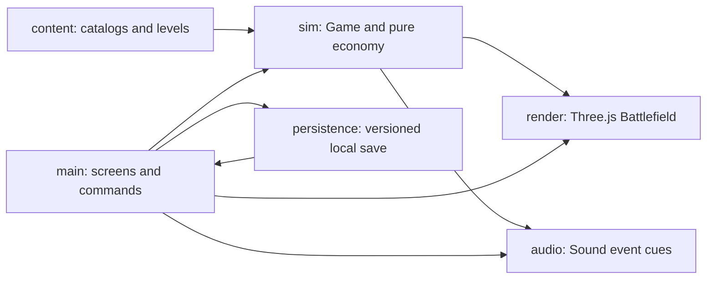

# Architecture and extension points

The working boundary is a browser-independent TypeScript simulation with presentation adapters. There is no server. Content definitions are plain data; a fresh `Game` owns every attempt.

| Boundary                                   | Implemented responsibility                                                                             | Extension point                                                           |
| ------------------------------------------ | ------------------------------------------------------------------------------------------------------ | ------------------------------------------------------------------------- |
| `src/content`                              | Tower/enemy/card catalogs and two encounters                                                           | Add level data, register it, validate and test                            |
| `src/sim/game.ts`                          | Commands, 30 Hz simulation, damage, movement, targets, waves and outcomes                              | Add a rule with focused deterministic tests                               |
| `src/sim/economy.ts`                       | Fixed wave rewards and sell refunds                                                                    | Tune authored rewards alongside catalog costs and strategy evidence       |
| `src/render/battlefield.ts`                | Flat orthographic painted battlefield, continuous trail, rig direction/aim, picking, range and effects | New visual without importing browser APIs into simulation                 |
| `src/render/cutout.ts`, `character-rig.ts` | Shared native textures, per-actor joints and view-aware walking                                        | Descriptor-driven parts; side IK and front/rear projected legs            |
| `src/main.ts`                              | Semantic HTML screens, input commands, attempt lifecycle and HUD                                       | New screen or input adapter; currently a deliberately small single module |
| `src/audio/sound.ts`                       | Gesture-unlocked music and synthesized cue family                                                      | New licensed track or cue, preserving volume/mute lifecycle               |
| `src/persistence/save.ts`                  | Version 2 validation/defaults, legacy save migrations, stars, settings, Squirrel upgrade and Turtle discovery                     | Explicit migration for future schema changes                              |
| `src/qa/benchmark.ts`                      | Separate artificial browser stress fixture                                                             | Raw RAF measurement; never used by normal gameplay                        |

Simulation commands return success/failure and emit lightweight events. The UI translates commands into feedback; rendering reads state. `advance` accumulates fixed 1/30-second steps and limits long-frame catch-up. `tick` is available to deterministic tests. Randomness uses a seeded generator; current encounter rules have no random targeting or damage. Fixed seeds alone do not make browser frame timings deterministic.

Coordinates use integer `x,z` grid positions. Paths are axis-aligned polylines;
rendered corner rounding is cosmetic. Occupancy excludes path tiles and blocked
tiles. Towers cannot reroute enemies. The presentation maps simulation coordinates
onto a flat orthographic stage with separate horizontal/vertical spacing, a painted
biome plate, and a textured continuous trail. Approved tower footprints remain
screen aligned. Runtime character rigs choose front/rear views for vertical travel
and side views for current rightward segments. Gait, reload and idle motion read
simulation time/distance, so pause freezes them. A structure hit is tested before
ground picking except during construction, when the exact ground cell wins.

## Add an encounter

1. Copy `src/content/lantern-pass.ts` into a new content file. Supply a unique id, dimensions, axis-aligned path, blocked cells, starting money, optional health multiplier, and wave groups/rewards.
2. Import and append the definition in `src/content/levels.ts`. Map order controls sequential unlocking.
3. Add its id to the save whitelist if persistent completion is required. The two MVP ids were reserved in the foundation.
4. Validate paths/placement and run an explicit strategy through the level. Add focused test coverage for new rules, not duplicate assertions for every field.
5. Check its map position, briefing, battle readability, intended duration, win and replay in the browser.

**Working extension evidence:** commit `3fbd136` adds Rainstone Crossing after foundation commit `48c9a4a`, changing only its content file and registry. No combat, renderer or UI restructuring was needed. The second reserved save id was already part of the agreed two-level scope. More than two map nodes require deliberate map layout work; this is not an unlimited campaign editor.

## Add a tower/enemy/card

Catalog data controls existing roles. Each encounter declares its available
defenders, while persistent progress declares which upgrades are usable. A
genuinely new attack behavior also needs a typed kind, simulation rule, asset bounds, UI explanation and tests. Do not
represent new mechanics as arbitrary strings or pretend the catalog can express
behavior it cannot. Rig resources map each role to generated parts; see
`ART-PIPELINE.md` for import, source provenance and visual review. Legacy atlas
indices remain fallback metadata. Advantage definitions can modify range, slow
duration, or upgrade cost, but remain dormant until a campaign reward explicitly
unlocks them.

## Current encounter rules

Lantern Pass teaches Rat guard and awards Squirrel upgrades. Rainstone Crossing uses four mixed Rat/Weasel waves and awards Turtle discovery. Spawn groups author internal quiet gaps, local movement multipliers and guard/evasion cycles. Evasion is deterministic at projectile impact; missed nets do not refresh slow. The renderer shares spawn-relative warning timing, then presents the yellow marker, sidestep and floating Evade text from simulation outcomes. See [decision 017](decisions/017-rainstone-evasion-and-mixed-waves.md).

Turtle's first campaign use and The Last Lantern are planned final-encounter work, not a registered third map yet.

## Planned boundaries

Extract screen controllers when more screens make `main.ts` unwieldy. Consider shared/instanced terrain geometry and sprite batching only after measurements identify pressure. A save migration registry, content editor, cloud saves, multi-biome campaign and dynamic camera are not implemented. Do not introduce abstractions for them in small content additions.

### Presentation resource costs

Flat articulated limb planes use a single transparent draw pass even when both
sides are visible; they have no separate front/back volume to composite. Impact
rings use one ordered dynamic geometry with per-vertex colour and alpha. The
batch preserves the individual ring topology, position, size and fade, with
regression coverage for growth and stale-effect removal. Neither optimization
changes simulation state or effect timing.

Reloading the same encounter clears actors and interaction overlays while
retaining its scenery and path textures. The reuse key includes the level id,
dimensions and route; a changed layout rebuilds the scenery. QA-only phase timing
separates figure updates, effect updates and synchronous WebGL submission, and
retains long-frame context. These timings do not measure GPU completion.

Character and defender rigs are reused through bounded pools keyed by asset,
height and (for defenders) reflected view. Checked-out rigs are never shared;
released rigs are detached from the scene, and all retained resources are disposed
with the battlefield. Pose and colour are recomputed from current simulation state
before a reused rig renders.

Grounding shadows and injured health bars use three instanced draws, with the
same circle/plane shapes and per-actor transforms as the prior individual meshes.
Unused instances are excluded by count and visibility; health backgrounds and
fills retain distinct painter layers.

Path projection is cached when an encounter layout is loaded. Each animated leg
owns reusable sampling and pose buffers; neither buffer is shared across actors.
The gait still derives contact from simulation distance, including through corners
and resets. Differential tests compare both maps against the simulation sampler.

Enemy leg meshes now keep static source vertices and apply bone pose uniforms in
the vertex shader. Side-view transforms retain the same two-bone blend; front/rear
views retain upright boots and projected cloth movement. Each leg owns its pose
uniforms, while materials share the compiled shader program. This removes repeated
leg vertex-buffer uploads without changing simulation or gait targets.
