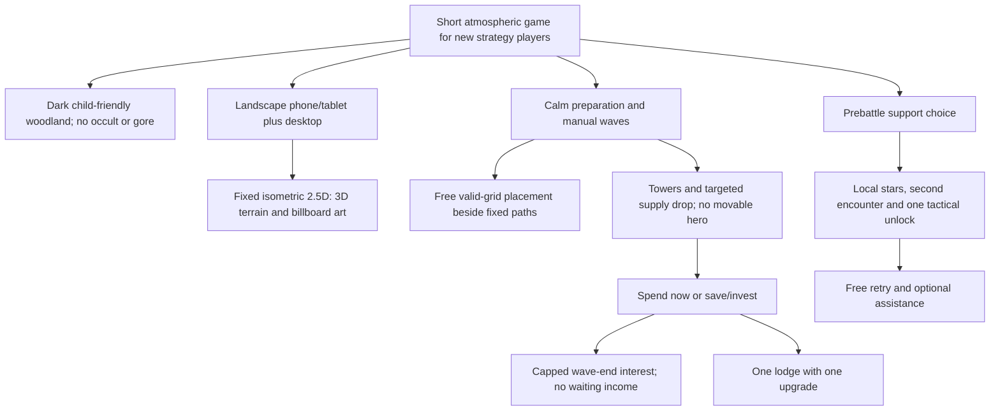

# Reference research and product decisions

Research was performed before implementation on20 September 2026. Direct observations, source claims and design interpretations are separated below. Reference screenshots remain in the local research folder; no reference-game artwork was incorporated into Stormwatch.

| Reference | Directly inspected | Lessons retained |
|---|---|---|
| [CuteDefense V2](https://jaxsbr.github.io/CuteDefense/?v=2) and [source](https://github.com/Jaxsbr/CuteDefense) | Title, tower placement/cost, combat, health/range, pause and upgrade/sell UI; read-only source review | Clear silhouettes and immediate feedback; preserve the already separated headless simulation, commands/events, fresh state and audio bridge |
| [Tower Legends article](https://phaser.io/news/2026/09/tower-legends-phaser-tower-defense) and [Steam store](https://store.steampowered.com/app/5012660/Tower_Legends/) | Cover, sampled trailer frames, field-guide illustration, tower arsenal and achievement presentation | Carry a coherent visual promise through cover, menus, map, choices and battle; prioritize atmosphere over a large roster |

CuteDefense source already had a fixed-step simulation boundary and test/benchmark commands; it was not treated as wholly unstructured. Its combined renderer/UI file was a pressure point worth avoiding. The existing suite passed196 tests during read-only research. That result belongs to the old game, not Stormwatch; no old performance numbers were reused as current evidence. Source/deployed revision equivalence was not established.

Tower Legends was not purchased or played hands-on. Trailer seeking failed in the research browser, limiting coverage. The inspected map was a field-guide illustration, not proof of an interactive map. Roster buffs, bosses and progression were attributed to developer descriptions rather than personally tested mechanics. One listed review was insufficient for reception conclusions. Energetic music appeal came from the owner's reaction; independent audio audition was unavailable. The store disclosed AI-generated graphics/music. None of this proves its full architecture or production workflow.

A pure2D framework, 3D-authored sprites and real-time3D were considered. [Phaser scenes](https://docs.phaser.io/phaser/concepts/scenes) provide an appropriate2D browser structure, while [Three.js sprites](https://threejs.org/docs/pages/Sprite.html) and [orthographic cameras](https://threejs.org/docs/pages/OrthographicCamera.html) support the owner's chosen hybrid. The final decision was3D terrain with camera-facing art and a locked angle; see ADR001. Generated models were optional, not a required demonstration.

## Resolved design tree

The owner accepted the recommendations with explicit corrections for darker non-occult art, hybrid isometric rendering, and a meaningful saving/interest/cashflow economy. Wave-end interest and an economy building were then explicitly approved. The integrated [scope and acceptance contract](SCOPE.md) was confirmed before implementation. Concrete rates, engine versions, data shapes and asset processing were delegated technical choices documented in ADRs.
