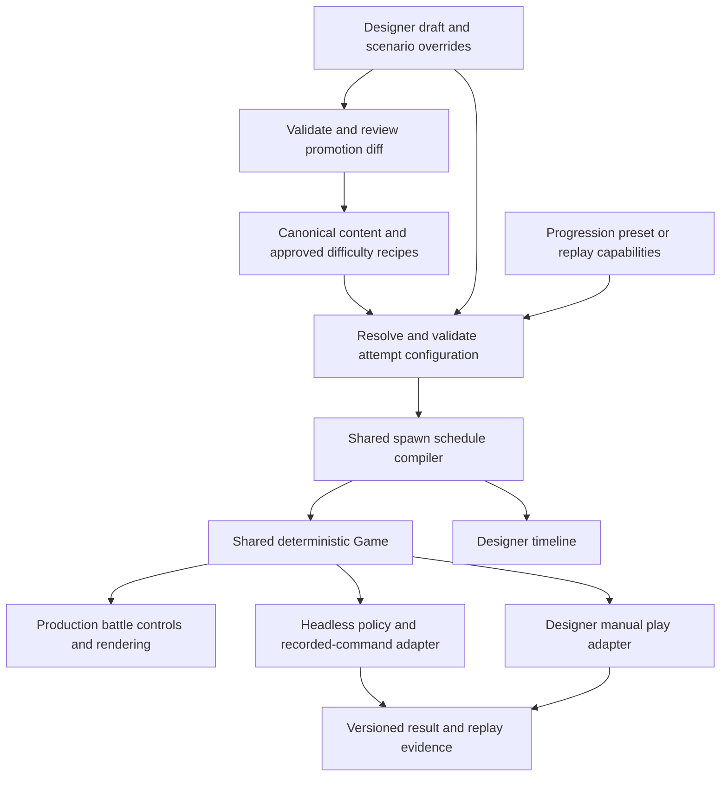

# Designer utility — proposed implementation plan

Status: approach approved by the owner on 27 September 2026. The [ready-for-agent specification](../../.scratch/designer-workbench/spec.md) is the implementation contract; this document retains the research and reasoning behind it. No implementation or difficulty tuning has occurred. Ticket 06 release verification remains a separate deliverable; previously demonstrated owner evidence should be collected there before repeating checks unnecessarily.

## Problem framing

The owner needs to see, edit and play authored waves while retaining control over their feel. Automated runs should reveal consequences and offer reproducible defense examples. They should not decide whether a wave is enjoyable or appropriate for either child. The utility must support future maps, typed enemy abilities, progression-aware replays and separately authored difficulty variants without becoming another game implementation.

The desired loop is: choose a map and wave → inspect the effective configuration → fork a draft → change a few values → play it or run a named defense policy → compare evidence → deliberately promote the chosen revision into the game's canonical content.

## What the code already supplies

- A browser-independent `Game` with fixed ticks and legal placement, upgrade, sell, pause and wave-start commands. This is the shared engine, not something to replace.
- Data-defined maps and waves, a three-map registry, per-group speed and shield/evasion timing, and progression-aware replay rosters.
- Deterministic strategy tests whose scripted strategies provide useful starting policies, not a general optimal player. A headless challenge runner also exists, but its old plans reference removed roles/economy and fail against today's first-map roster; reuse its launch pattern, not its stale scenarios.
- A shared scheduler, whose authoring details are hard to inspect visually: a group's final cadence and the next group's extra delay both contribute to the next arrival. The utility should make those consequences visible without changing existing recipes during extraction.
- Global catalog imports and several hardcoded mechanic constants that prevent complete per-attempt draft isolation today.
- Production build entries for both the game and the QA page. Excluding development utilities requires correcting this existing arrangement too.

Source analysis: [content and progression](2026-09-27-designer-utility-content.md), [playtesting and automation](2026-09-27-designer-utility-playtest.md), [build separation](2026-09-27-designer-utility-build.md).

## Proposed seams

The production game imports the shared simulation, approved content and battle presentation. It never imports the editor, policies, draft storage, file-writing support or research fixtures. The designer and headless runner depend on the shared game; the game does not depend on them.

## 1. Establish one editable content contract

Introduce validated, serializable authoring data for current recipes, retaining repeated packets as editable patterns instead of forcing the designer to edit long expanded spawn lists. One canonical source generates or directly resolves the `LevelDef` consumed by the game. Do not maintain hand-edited JSON beside independently edited TypeScript recipes.

Extract one schedule compiler used by both `Game` and the timeline. Preserve exact existing spawn times, group ordering, initial delay, batch semantics and ability timing. Show actual spawn timestamps, last scheduled spawn, enemy totals and the quiet time between packets. Last scheduled spawn is not a promise of wave completion time.

Resolve immutable catalog and supported rule parameters per attempt. Simulation, range overlays, HUD costs and manual controls must all read the same resolved values. Keep inherited defaults visible, with the source of each override: catalog, map, wave/group, difficulty or scenario. Reject invalid counts, cycles, cadence, unknown kinds and unsupported overrides rather than silently correcting them. Define and validate whether batches may overlap; today's insertion-order queue is not a safe interpretation of arbitrary overlapping edits. Distinguish nominal schedule time from the fixed-tick time at which an enemy actually appears.

Start with existing controls: group composition/count, spacing, batches/stagger, delays, repeated packets, movement, Rat guard, Weasel evasion, start gold, rewards, health scaling and current boss settings. Catalog adjustments must explicitly distinguish a scenario experiment from a proposed global change. A genuinely new ability still needs a typed rule, tell and tests; the utility is not an arbitrary ability scripting language.

## 2. Build the map/wave register and visual inspector

List maps in campaign order with expandable waves. Each row shows the wave's title and stable identity, composition, selected difficulty, intended lesson/goal and saved revision. Display expected first-arrival defenders, upgrades and advantages, plus rewards and the next unlock. Use the actual progression resolver rather than a manually maintained parallel table.

Drilling into a wave opens three linked views: its editable packet recipe, an enemy-colored spawn timeline and a map preview. Select a packet to inspect count, spacing, rest, speed and ability cycles. Ability cycles are spawn-relative; do not misleadingly draw them as one global shield/evasion window for every enemy. Advanced fields disclose effective defaults and their scope. A change preview highlights affected packets and the difference from the released baseline.

A full terrain/path painting tool is not needed for the first useful version. The register and existing map preview support authored maps while the new seam makes later map authoring possible.

## 3. Play drafts safely, with selectable progression

Launch the actual battlefield and normal battle controls against the selected draft. Provide normal-speed play, pause, restart and faster playback, using simulation ticks rather than changing enemy rules. New edits apply on a deliberate restart; do not rewrite a running attempt's configuration halfway through it.

Offer separate scenario presets: first arrival with legitimate unlocks; replay with earned capabilities; or explicitly overridden towers, upgrades, advantages and resources. Drafts and attempts use separate utility storage and never write the family's game profiles.

Support a full-map run and an isolated-wave scenario with an explicit starting wallet and loadout. Label the isolated setup as synthetic. For an authentic wave-six setup, replay recorded legal commands through preceding waves and branch at the preparation point. `GameState` alone does not contain the engine's private queue and other necessary state; copying it is not a trustworthy checkpoint. Introduce a complete checkpoint interface only when a measured need justifies it.

## 4. Add automated assistance with explicit goals

Port current scripted spending/placement lines into named policies that issue the same legal commands as the human player. Add configurable decision cadence and resource/roster restrictions so results disclose how reactive the player was. A bot that purchases at every tick should not be presented as a childlike strategy.

Goals include clearing a selected wave, winning the map including required boss defeat, or completing with no lives lost. Run several policies or a bounded search over legal placements and upgrade timing against a fixed candidate configuration. Return successful plans with their command logs and visible playback, not just a success percentage. Failure to find a plan is evidence about that search, not proof that the wave is impossible.

Track wave checkpoints, hearts/leaks, leak enemy and timing where instrumentation supports it, gold, purchases/upgrades/sales, tower mix, boss outcome and simulated time. Candidate comparisons hold the scenario and policy constant. If a policy retunes itself for each candidate, label that separately. Record content hash/revision, engine revision, progression preset, overrides, seed, decision cadence, policy version or command log with every result. Automated findings support the designer's playtest rather than replace it.

## 5. Save drafts and deliberately promote them

Keep a released baseline, named draft revisions and saved scenarios/results. Allow export/import for transfer between the design computer and test devices. Draft revision history is useful before a change is accepted; Git remains the record of accepted content.

Promotion validates the candidate, checks the baseline has not changed, presents a diff and writes only the selected canonical content. Browser draft saving and repository saving are distinct operations. Start with validated file export plus a local promotion command; add a tightly scoped local writer if the workflow needs a one-click operation. GitHub Pages does not provide this writer.

Run the required project checks after promotion and verify that the built game resolves the exact configuration that was tested. Preserve the previous accepted recipe so reverting a balance change is straightforward. Cosmetic changes still require visual verification; rule changes need focused deterministic tests.

## 6. Support separately authored difficulties

Make difficulty a named recipe variant resolved before an attempt, with visible per-map/per-wave differences. This should support different packet counts, rests and ability durations as well as resource adjustments, rather than assuming one health multiplier produces good pacing for both children.

Expose the current normal/assist behavior as the initial baseline without redesigning it. Keep difficulty separate from progression and replay entitlements. The utility can compare proposed easier/standard/harder configurations, but names, player-facing selection and star/unlock behavior require an owner decision before shipping those variants. Two player slots do not automatically imply two permanent difficulty assignments.

## 7. Keep the utility out of the deployed artifact

Use separate entry points and build outputs: a game-only Pages artifact, and a local designer utility. Production excludes `qa.html`, designer routes, fixture injection, policies, diagnostic query switches and local writing support. Verify both the emitted files and imports, including accidental assets copied from a public directory; a hidden navigation link is not sufficient.

The shared simulator and approved wave data necessarily ship to the browser. Their visibility cannot be prevented in a fully client-side game, and a player controls their own local save. The practical benefit is removal of ready-made debug controls and clear production separation, not secret or tamper-proof rules. Server-side authority would be another product scope and is unnecessary for this local family game.

No upstream or hosting changes are part of this proposal. Once configured, the existing Pages workflow can publish only the verified game output.

## 8. Make the tool navigable for agents

Provide stable map/wave IDs with a campaign-number lookup, so “map 3, wave 6” resolves to the actual content, supported settings, intended capabilities and related scenarios. Avoid relying exclusively on array offsets as durable identities.

Expose listing, inspection, validation, run, comparison and promotion through the same headless interfaces used by the editor, with structured machine-readable input/output. Agents should not have to operate the browser to adjust a draft or reproduce a report. Record where game rules, canonical content and utility code live in the architecture and agent guidance after the design is accepted. A tuning task changes content; a new mechanic changes simulation plus presentation; an editor task changes the utility. Keep authored intent and observed results distinct.

## Delivery sequence and acceptance

1. **Foundation and parity:** extract schedule/configuration resolution and separate production output. Existing recipes and legal-command replay outcomes remain unchanged.
2. **First usable vertical slice:** map/wave register → packet/timing editor → isolated draft → manual play → save → validated promotion. Use the current Last Lantern wave-six recipe as the example, preserving its values until the owner chooses edits.
3. **Reproducible assistance:** headless policies, goal evaluation, visible command replay and matched candidate comparisons. Start from existing strategies before expanding search.
4. **Difficulty and broader authoring:** saved difficulty candidates, replay progression permutations and additional mechanic editors as those mechanics are implemented. A full map painter or universal optimizer is deferred.
5. **Ticket 06:** collect existing owner verification, add candidate evidence from the utility and complete release/device checks. A balance report is not a substitute for child comprehension, physical-device checks or handoff.

The first usable slice is accepted when the owner can visually understand a wave, fork it, change spacing or an ability cycle, play it with legitimate or overridden capabilities, preserve the draft, and promote it without changing production until that explicit promotion. Tests additionally verify timeline/simulation parity, draft isolation, capability restrictions, promotion round-trip, deterministic reproduction and the absence of utilities in the deployed artifact.

## Choices to review before implementation

- Whether validated export plus a local promotion command is sufficient initially, or repository writes must be one-click from the editor.
- Whether draft play must be reachable on tablets immediately; keep any local file-writing support confined to the design machine even if play is shared.
- Whether the first automated milestone should compare known policies only or also include a bounded goal-driven placement search. The proposed sequence makes manual play useful first and adds search next.
- Whether named difficulty variants should initially remain design-only or include a separately specified player-facing release change.
